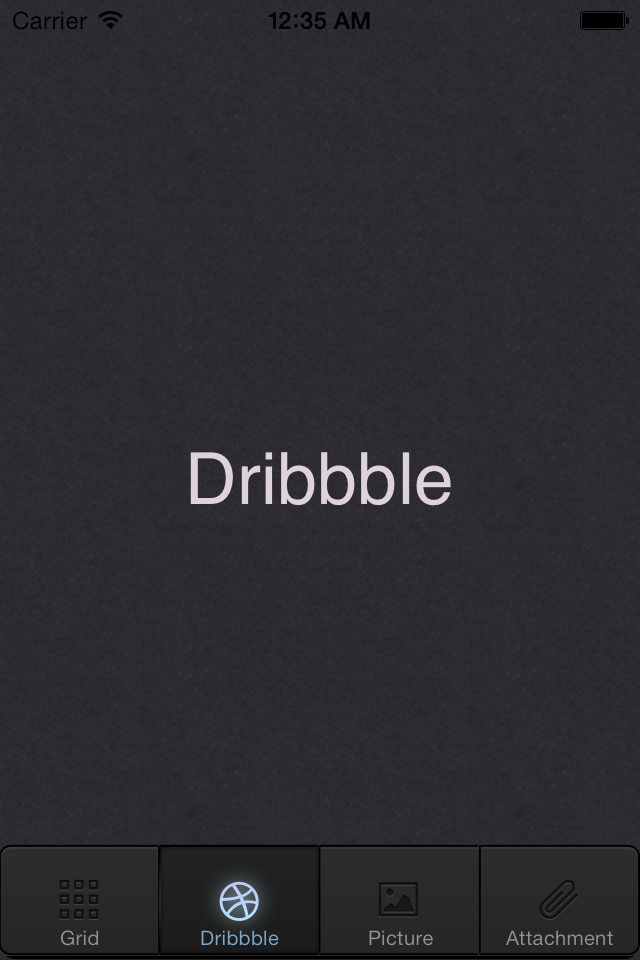

Dribbble_Concept
================

######A simple example of how you might customize the UITabBar and UITabBarItems using the UIAppearence API
######and customized images for both the selected and unselected tabBaritem states.
 

 

Special thanks to [Johan Geijer](http://www.jgeijer.com) for creating the concept and freely sharing it.

Original Concept: [Button Free PSD]( http://dribbble.com/shots/694671-Buttons-Free-PSD?list=searches&tag=buttons_psd).

